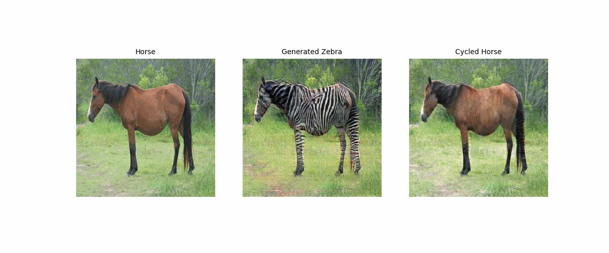
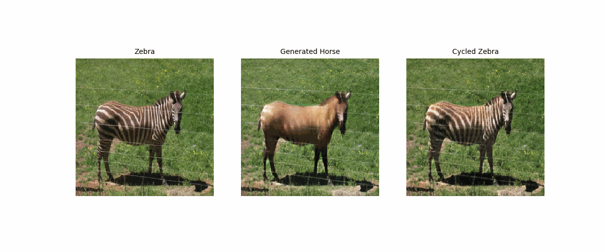

# <h1 align="center">CycleGAN</h1>

 

<i>Source: TensorFlow</i>

CycleGAN, based on the paper [Unpaired Image-to-Image Translation using Cycle-Consistent Adversarial Networks](https://arxiv.org/abs/1703.10593) by Zhu et al. (2017), offers a solution for image translation between domains without requiring paired training examples. It involves capturing the characteristics of one image domain and learning to map them to another domain, resulting in a powerful tool for image manipulation.

## TensorFlow and PyTorch Implementations

To explore the capabilities of CycleGAN, implementations were done in both TensorFlow and PyTorch, the two most widely used frameworks in Deep Learning. Each implementation provides deep insights into the differences and similarities between these frameworks, offering practical perspectives for deep learning practitioners.

- [TensorFlow Notebook](https://github.com/JersonGB22/DeepLearning-TensorFlow-PyTorch/blob/main/GenerativeDeepLearning/CycleGAN_horse2zebra/TensorFlow.ipynb)

- [PyTorch Notebook](https://github.com/JersonGB22/DeepLearning-TensorFlow-PyTorch/blob/main/GenerativeDeepLearning/CycleGAN_horse2zebra/PyTorch.ipynb)

## Dataset Setup

The "horse2zebra" dataset was chosen, consisting of directories of images of horses and zebras. In the case of PyTorch, the dataset is accessed through a download or direct link from [my Personal Drive](https://drive.google.com/drive/folders/1sQmAlteOtIQV_mg2meP25xe34NO3YTTm?usp=drive_link), while TensorFlow enables direct loading of the dataset using TensorFlow Datasets.

## Key Components of CycleGAN

Among the crucial aspects of CycleGAN are:

- **Instance Normalization:** CycleGAN adopts [instance normalization](https://arxiv.org/abs/1607.08022) instead of [batch normalization](https://arxiv.org/abs/1502.03167), significantly influencing training stability and model performance.
- **Generator Architecture:** A generator architecture based on [U-Net](https://arxiv.org/abs/1505.04597) is implemented, renowned for its effectiveness in image generation tasks.
- **PatchGAN Discriminators:** Inspired by the [pix2pix paper](https://arxiv.org/abs/1611.07004), PatchGAN discriminators are used to evaluate the authenticity of generated images at a patch level, providing detailed feedback.
- **Cycle Consistency Loss:** A cycle consistency loss is introduced to ensure accurate mapping between image domains. Since CycleGAN lacks paired data available for training, this loss plays a crucial role in model convergence and the quality of generated translations.

## Exemplary Results

 

 

The exemplary images and GIFs of the results are located in the [images folder](images), with additional examples available in the notebooks.

## Technological Stack
 

## Contact

